# How to Create an USB Flash Drive Automated Killdisk with Active Data Studio Tools, DaRT Tools, Net/WIFI, and Report, Logs, Certificate sent via Email to you.

## Note- I believe I have uploaded all required files, folder, examples, etc… many of the actual project files, ISO, WIM, and other resources will be generated when building the project so the uploads here at Github are not a completed project in themselves. When completed, it should be a re-usable, automated tool for use. Look at the references folder and you can go to reference websites for more detailed information on different build structures. It’s a bit of a challenge going through getting it all setup, but once it works, it Rocks!

### Suggested Tools

### Killdisk Data Studio

### Or

### Killdisk Pro/Pro Suite/Ultimate

### Power ISO

### Pea Zip

### Skills in archive/compressed tools like PowerISO or Pea Zip

### Text Editor

### Skills with editing or tweaking scripts or figuring out what settings might need modified.

### Ability to search online for answers to questions.

## End Goal: Purpose of Project: To create an isolated Network PXE Boot server that 5-20 client computers can connect to via PXE boot, install Killdisk WinPE Utility, AutoStart Killdisk, do a DOD Compliant Erase of Hard Drives (3 Passes), create the Report, Log, and Certificates, copy them to a network drive location, and send an email with the Report, Log, and Certificates.

## As a “Milestone” is this project. If followed and my documentation correct the Boot from the USB Drive Killdisk will AutoStart a DOD 3 pass ERASE. The settings.xml can be modified to put a safety-stop mechanism where you are prompted with the standard “ERASE-ALL-DATA” confirmation.

## This would leave a project creator / user of project to only having to update my ticket notes, and attach the files to the ticket and close ticket, which is a great reduction to the current burden of the existing process.

## \*Active studio, as of latest version uses the 20H4 files in the WinPE Disk. It is possible helpful, if you also use this same version of Windows 10 64 Bit 20H4, especially if you need Windows files, Drivers, System32 directory files, etc.… if you need to use DISM, are injecting or extracting files, modifying or creating BCD files, etc.…which you will probably be doing if you are creating a near identical project tool for yourself.

## I HIGHLY recommend PowerISO also as a tool. Besides being able to open ISO, IMG, WIM, Extract/Add files and folders it has a GUI DISM interface. Bootable ISO files can be modified, and it does not break the boot capabilities of the ISO. I bought a license for this program, and it is worth the paid price many times over. PeaZip was also very helpful, mainly both for a similar reason is that they could re-inject files in .WIM, .ISO, or archives that were originally used and in nearly every use case did not corrupt the files which saved a lot of time.

## Tools and Equipment needed for this project:

## Two Computers at least. One for the PXE Server, one for the victim to KillDisk app. I will not go into details of Hyper-V or VMware, but you can test that way as well. Look online for setup details.

## At least a 4 port 1GB unmanaged switch

## Ethernet Cables

## My PXE Server is a Windows 10 64 Bit laptop and the Tiny PXE Server App. I have a WIFI Card and a 1GB Ethernet NIC in it. I am planning to Test both the Wired and WIFI connections for the “Email Sending of the Documents via smtp server” but the boot.wim file download and launch of KillDisk is using Wired Network Connection.

## My Testing- I used Hyper-V, and 2 old desktops for physical PC testing, and used my phone tethered to see if it would work, and it worked and sent email. I wanted the portability of being anywhere at the plant I work at and can perform DOD Erases.

## Starting the Project – Please read through first because if you do not need some of the extra tools and just need the Killdisk to automatically run and send certificate via email, it will be a simpler process for you.

## BEGIN STEPS

## Purchase Killdisk and get license key. The Active Data Studio is a great value. Just several times using product and it will pay for itself in saved tech time.

## Install, get setup, and take a look around to familiarize yourself with the options and interface.

## Launch the Killdisk Desktop Client App and from main toolbar menu go to:

## Tools\> Preferences. Go through each option very carefully, and choose the options you want. This is very important because this is how your settings will be saved. When your settings for Killdisk are saved, they are saved to an SETTINGS.XML (No longer in

## the killdisk.ini file) file. When you create your ISO file or Flash Drive Boot Disk the settings.XML is where all your options and parameters are stored. I copied the settings.xml to a backup folder so I can use to compare with second or third tests I may need to do. Attached you should find the script LaunchKilldisk12.cmd which you will need when creating boot disk. The settings.xml file will be copied from Killdisk programs location when creating boot disk on flash drive or iso.

## SMTP Settings= Try Port 80, I could not get 25, 2525 to work.

## Creating 1st run of Boot Disk- These screenshots show a few settings you will want to be sure are set.

## Windows Boot Disk Selected:

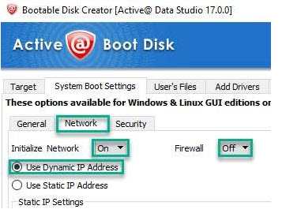

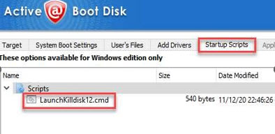

## LaunchKilldisk12.CMD Script – Name it what you like but add it from this tab

## ---------------------------------------------------------------------------------------------------------------

## cd /d %\~dp0 set dr=%\~d0 set kdcert=%dr%\\_kd\\cert set kdlog=%dr%\\_kd\\log set kdreport=%dr%\\_kd\\report set kdsettings=%dr%\\_kd\\Settings IF NOT EXIST %kdlog%\\NUL md %kdlog%

## IF NOT EXIST %kdcert%\\NUL md %kdcert%

## IF NOT EXIST %kdreport%\\NUL md %kdreport% IF NOT EXIST %kdsettings%\\NUL md %kdsettings%

## x:

## cd "x:\\program files\\bootdisk"

## IF EXIST %kdsettings%\\settings.xml copy %kdsettings%\\settings.xml "x:\\program files\\bootdisk" Killdisk -cp=%kdcert% -lp=%kdlog% -ea -xr copy "x:\\program files\\bootdisk\\settings.xml" %kdsettings%

## 

## end of script

## You do not have to create the disk and do a “Alpha First Erase Test” but it will give a little gratification, and it is a good way to test what worked and what did not. My first run as an example did not put all the logs and reports where I wanted them, the wired network, although connected to internet and working did not sent the emails. There were also a few other things I found out I wanted to change in my settings.xml so I had to go back into preferences, resave the xml file with new settings. If you do want to do a first run know that it will take probably 3-4 hours.

## First Run Results

## After the first run you can make notes about what needs corrected, what did not work.

## Most notably you may not have gotten an email at the end of the erase process, and the network connection might not have been active with an internet connection. Now it the time to try and figure out how you are going to fix those problems.

## Fixing the Network Drivers issue

## During the Boot Disk Creation process there is an option to “Add Drivers”. So we can add the drivers through that option or modify the boot.wim file.

## If doing the Hard Drive Erase Process on many PC’s with dis-similar hardware we either 1, have to modify the Wim File and inject the drivers, 2, have to use a small batch of same model Network Cards by either installing them or using USB Models, or if there are not a huge number of drivers can use the Killdisk Boot Wizard and install them. I hesitate to use the Boot Disk Wizard because I have noticed problems with it failing on injecting the drivers, but, it is the easiest option so we will try that as first choice.

## You will need to know the make and model of the Network Card Driver you need. We will take a Dell Computer Model as an example and download the driver from Dell’s Website. The simplest way to get the correct driver is to look up the model PC we have and go get the drivers there.

## I am downloading the WIFI driver and the Wired NIC Driver for Windows 10.

## Also, Dell has WinPE Driver pack of Storage and Network Drivers (Usually for OEM/ PC Builder, etc…) and I am downloading this pack. I am only going to use the Network, 64 Bit Drivers out of the pack. Also, I am only searching for the .inf files out of all the folders listed in the screenshot and will combine all the .inf drivers in one folder for the making of the Killdisk Boot Disk.

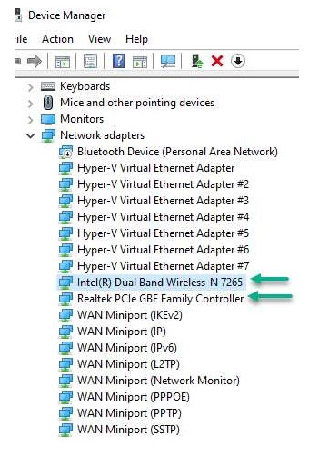

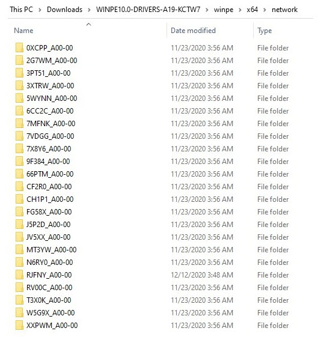

## Driver files copied into one folder. They include the Dell WinPE 64 Bit Network Drivers, and 2 specific Dell Model Network Drivers. My project is with nearly all Dell Model laptops and desktop, and most 64 bit, but the negative is that I am unsure of every single possible model so this means I will have to copy some of the certificate, log, and report files manually but still get about 80-90% done using the automated KillDisk solution.

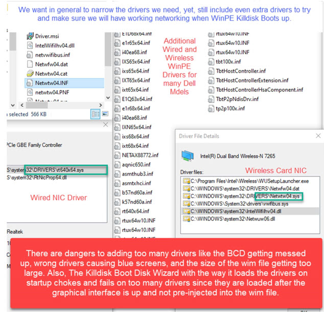

## For now, leave all the .inf files in one folder, and put them in your project folder for later when we rebuild the Boot Disk.

## Adding PENetwork to the Killdisk Boot Disk

## We need a better solution than what the Killdisk Boot Disk offers for network support so we are going to add a 3rd party tool. I actually love this tool and major KUDOS to making this tool because it is phenomenal! You can get the PENetwork tool at: https://www.penetworkmanager.de/

## Be sure to get the correct x86/x64 version that you need.

## 

## Modifying the Boot.wim file

## Here is what I ended up doing because the Lsoft Active Boot Disk is limited on some of the files and functionality I need. After reading up I found out I would have to spend hours manually getting the WIFI support and other functionality.

## Using the WinRE.WIM as my BASE WinPE media

## I ran these commands to get the WinRE.WIM file and then ran the second command to put it back as recovery:

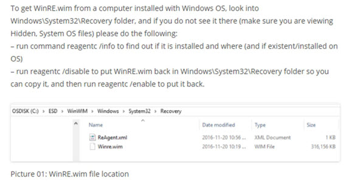

## I extracted all the Active Boot Disk files from the boot.wim, and then mounted the Microsoft WinRE.WIM.

## I copied over all the files from c:\\Windows\\system32 Lsoft boot.wim, but only copied over files that were not there.

## I copied the Default and Public profiles from Lsoft Active boot.wim file over to the mounted Microsoft WinRE.WIM file.

## I copied c:\\program files\\\* over to the WinRE.WIM file.

## In the WinRE.WIM file I deleted the c:\\Windows\\system32\\ Winpeshl.ini file

## 

## 

## 

## And I also made sure to use the Lsoft Active StartNet.CMD file in c:\\Windows\\System32\\ of the boot.wim and copied it over to the WinRE.WIM file.

## So, we have now the WinRE.WIM, with needed files and folders from the Active Lsoft Boot.wim file.

## Adding DART to the WinRE.WIM

## I am going to skip explaining this this process, but you can add all the Dart files to c:\\Windows\\system32\\ of the WinRE.WIM and then you can add the Dart EXE to the c:\\uses\\default\\Desktop folder and when the WinPE USB Boot Disk loads it will load up with a desktop shortcut to Dart Tools Windows Repair and Windows Recovery and Desktop shortcuts as well.

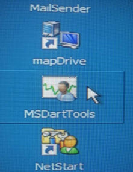

## NOTE- This is a little bit screwy, in the sense that first, I probably will not use these two options very often if at all, but you can really maybe get to these environments this way, but to try and get back to the Active Lsoft WinPE boot disk again, I will probably have to reboot because the shortcut is really a pointer just to repair or recovery but no way back to my WinPE desktop.

## Lsoft WinPE Boot Disk Menu and Desktop

## The WinPE menu and desktop are primarily a few different components:

## Startnet.cmd

## CFG_WinPE.exe

## Shell_pic folder

## Data_shell.cfg

## Honestly, at first, I was baffled how they got their desktop and menus to work, but it is a bit of genius I think, and the .cfg menu building is so versatile. I am keeping it for reference on other WinPE boot disks. If it is not in the .cfg file it will not show up in the programs list.

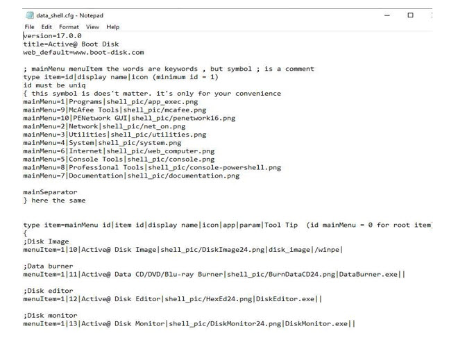

## We are almost done! Tank Da Lawd! Phew!

## Building the rest of the data_shell.cfg menu.

## So I had to add and build the PENetwork and McAfee Decryption menu items and add the folders with the apps in c:\\Program Files\\

## Then I unmounted the image and committed changes.

## If you remember, we have created an Active Lsoft Boot disk.

## So we have the boot.wim file on the USB Flash Drive we created the the Active Lsoft Boot Disk with.

## I renamed the WinRE.WIM file to boot.wim, and replace the boot.wim that is on the USB Flash Drive in the Sources folder.

## TIME TO DO A TEST USB BOOT!

## Car Screech…EEErrrrrrrrrrrrrrr….

## I am having a wireless driver issue and had to put the prompt back in settings.xml ( KeyPhrase Required to Continue with Killdisk Action) so I could cancel out of Killdisk if I needed to at boot up. So, it is booting… but I had to add the driver after the WinPE boot disk booted up with the “Install Driver” utility. I will inject it into the wim file so it automatically loads in the future…

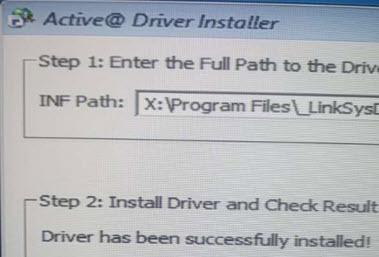

## Then, I used the PENetwork Utility to select the WIFI Card as active default

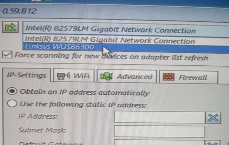

## This is the “Checkpoint” I added to stop Killdisk from literally booting and starting a DOD 3 pass Erase on Disk. It works, I ran 3 test, and finally got the email working with using port 80 while using a WinPE boot disk. The stop here was helpful because I needed, and am still working out details on tools, menus, etc.… I have been modifying the shell_pic directory with free icon sets available online.

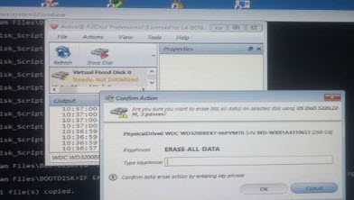

## At the end of the Killdisk Erase, an email can also be sent via a little app Lsoft provides. I got a free SMTP2GO account, and tested it and it works, again using port 80 when using the WinPE Boot Disk. I am not sure why I could only get it to work on that port, but it does not matter to me as long as I have the sent email. Just curious to learn why though.

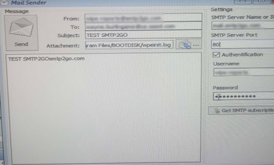

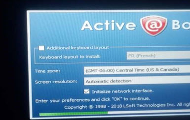

## And running Killdisk…but when it gets done I do not get certificate emailed to me.

## Ok, in settings.xml change the SMTP port to 80 if using a WinPE Boot Disk. The port setting you may need to adjust depending on networking environment. You can possibly try a built-in powershell command or smtp service, or port 80 may work.

# OVERVIEW-Final Results:

## So, here is what we have, and this is all true WinPE but with a custom setup for menus, and desktop. Note- I think Active Lsoft has files somewhere it is using for HTA or WPF files somewhere but I have not found or figured out exactly how their menu system is working.

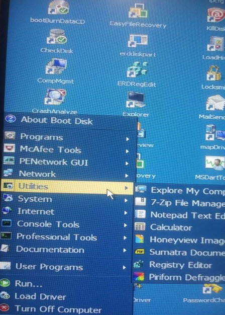

## All of this is all Embedded in the WIM file so we are ready to start the network boot processes and testing, but this is the beginning of a few new issues like where Killdisk will write and save the : logs, reports, and certificates to if using a network boot.

## I either need to do SMB Shares/ Mappings, or figure out how to get Lsoft Killdisk app to zip them up and then send an email with a zip file of the document’s.

## I was thinking I would have to use a bat/cmd script to zip files up and send via SMTP Account.

## Any ideas are welcome.

## I am at a stop here, because I ran into issues with my Lsoft Active Data Studio app, Hyper-V, and the Tiny PXE Server I was doing my testing on and am working on fixing this issue.

## But, we have success with WinPE with custom menus, apps, automated the killdisk to do a DOD 3 pass Erase with Certificates, Email sent, and an option after the Erase is done to send an additional email with attachment.

## Note- I need the Dart, McAfee, and other apps because I sometimes have to do other pre-work before a DOD Erase, but if someone does not need to do all those other things, just remove the

## (KeyPhrase Required) in the settings.xml and this boot disk will boot and start the Killdisk process on it own, and send the documents at then end when it is done.

## I am either going to use USB WIFI cards ( All Same Model) or have to gather a list of drivers , download and inject them into the wim image. I think we have about 20-30 models, and the failures do manually, or crush or destroy those.

## If I can get the IPXE Boot working, then we can do about 10-20 at one time.

## One hold-up being the politics at my work, where they trust us with unlimited USB Flash drives but not an isolated Network IPXE Boot Server. I know it takes 4-8 hours for each Killdisk process to complete, and although that is not total tech cost time, there are other administrative tasks we do in conjunction with the process, creating tickets for the process, transferring files from USB to our own PC, attaching the documents, and closing the ticket. As well we have to move , organize, and store the units in preparation for recycling company, etc…

## I best can come up with ways to save company money regarding this timely and costly procedure/process.

## I am hoping screenshots, videos, and documentation may help overcome the indifference or lack of understanding how things could work for our benefit getting a little more high-tech and automated.

## I believe everything should be functional.

## Please do leave comments that way others can know of problems, tweaks that need to be done that will help setup go more smoothly for them creating the USB Boot Disk.

## Here are the testing screenshots, and Killdisk and email sending works.

## ISO Directory Structure- This is my ISO file directory structure, but your may be slightly different depending on folders, tool, etc… you may add.

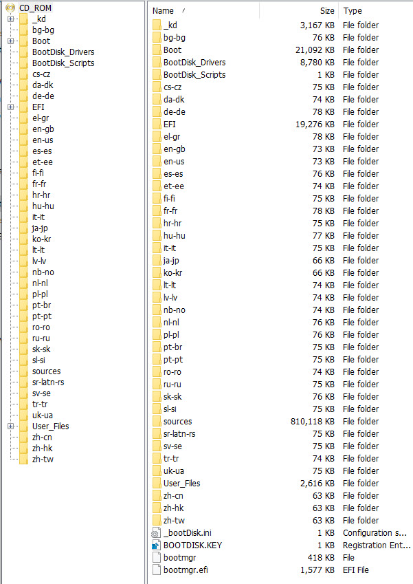

WIM File Example

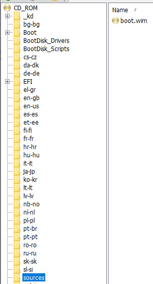

WIM file and folder contents example. In the Program files folder you can add more tools that are compatible with boot disk utilities. Be aware you may need to modify the Menu CFG file for them to be visible in the menu once booted up.

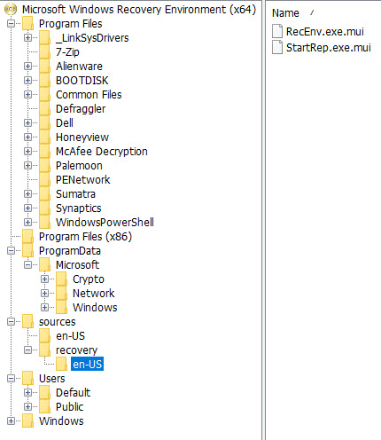
